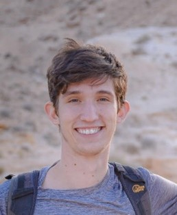

# Hi there 👋

Hi, I'm **Itamar Talpaz** (talpazi · he/him), a life sciences PhD student at Ben-Gurion University and a member of [Ecological Complexity Lab](https://ecomplab.com/). I'm passionate about nature and science.

  

- **Location:** Be'er Sheva, Israel  
- **Academic Profile:** [ORCID](https://orcid.org/0009-0008-9292-4599) · [ResearchGate](https://www.researchgate.net/profile/Itamar-Talpaz)  
- **LinkedIn:** [Itamar Talpaz](https://www.linkedin.com/in/itamar-talpaz-923473273)  

Feel free to explore my projects and connect with me!

---

## 🌍 Navigation  
· [Home](index.md) · [CV & Publications](cv.md) · [Gallery](gallery.md) · [Projects](projects.md) · [Contact & Links](contact.md)  

---
